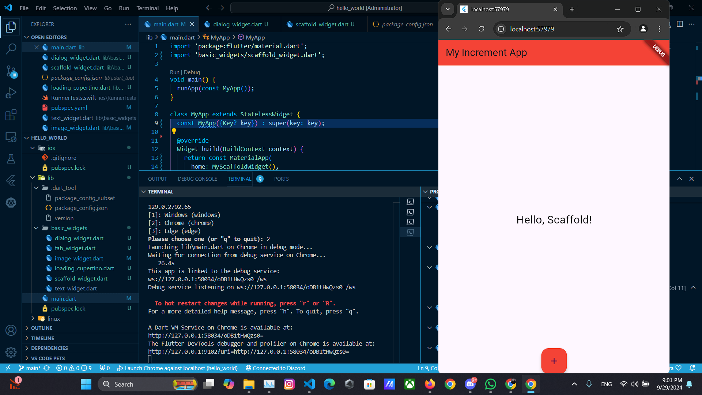

# hello_world

# NAMA : ALKADAFI FIRNAWAN
# NIM  : 362358302108 
A new Flutter project.

# Praktikum 1
Langkah 1
Buka VS Code, lalu tekan tombol Ctrl + Shift + P maka akan tampil Command Palette, lalu ketik Flutter. Pilih New Application Project.

Langkah 2
Kemudian buat folder sesuai style laporan praktikum yang Anda pilih. Disarankan pada folder dokumen atau desktop atau alamat folder lain yang tidak terlalu dalam atau panjang. Lalu pilih Select a folder to create the project in.

Langkah 3
Jika sudah selesai proses pembuatan project baru, pastikan tampilan seperti berikut. Pesan akan tampil berupa "Your Flutter Project is ready!" artinya Anda telah berhasil membuat project Flutter baru.

# Praktikum 2
Langkah 1 
Login ke akun GitHub Anda, lalu buat repository baru dengan nama "flutter-fundamental-part1"

Langkah 2
Lalu klik tombol "Create repository" lalu akan tampil seperti gambar berikut.

Langkah 3
Pilih menu Source Control di bagian kiri, lalu lakukan stages (+) pada file untuk mengunggah file pertama ke repository GitHub.

Langkah 4
Lakukan push dengan klik bagian menu titik tiga > Push

Langkah 5
Salin tautan repository Anda dari browser ke bagian ini, lalu klik Add remote

Langkah 6
Lakukan push juga untuk semua file lainnya dengan pilih Stage All Changes. Beri pesan commit "project hello_world". Maka akan tampil di repository GitHub Anda seperti berikut.

Langkah 7
Kembali ke VS Code, ubah platform di pojok kanan bawah ke emulator atau device atau bisa juga menggunakan browser Chrome. Lalu coba running project hello_world dengan tekan F5 atau Run > Start Debugging. Tunggu proses kompilasi hingga selesai, maka aplikasi flutter pertama Anda akan tampil seperti berikut.

Langkah 8
Silakan screenshot seperti pada Langkah 11, namun teks yang ditampilkan dalam aplikasi berupa nama lengkap Anda. Simpan file screenshot dengan nama 01.png pada folder images (buat folder baru jika belum ada) di project hello_world Anda. Lalu ubah isi README.md seperti berikut, sehingga tampil hasil screenshot pada file README.md. Kemudian push ke repository Anda.

# Praktikum 3
Langkah 1
Buat folder baru basic_widgets di dalam folder lib. Kemudian buat file baru di dalam basic_widgets dengan nama text_widget.dart. Ketik atau salin kode program berikut ke project hello_world Anda pada file text_widget.dart.

Langkah 2
Buat sebuah file image_widget.dart di dalam folder basic_widgets dengan isi kode berikut.

# Praktikum 4
Langkah 1 Cupertino Button dan Loading Bar
Buat file di basic_widgets > loading_cupertino.dart. Import stateless widget dari material dan cupertino. Lalu isi kode di dalam method Widget build adalah sebagai berikut.

Langkah 2 Floating Action Button (FAB)
Buat file di basic_widgets > fab_widget.dart. Import stateless widget dari material. Lalu isi kode di dalam method Widget build adalah sebagai berikut.

Langkah 3 Scaffold Widget
Scaffold widget digunakan untuk mengatur tata letak sesuai dengan material design.

Langkah 4 Dialog Widget
Dialog widget pada flutter memiliki dua jenis dialog yaitu AlertDialog dan SimpleDialog.

Langkah 5: Input dan Selection Widget
Flutter menyediakan widget yang dapat menerima input dari pengguna aplikasi yaitu antara lain Checkbox, Date and Time Pickers, Radio Button, Slider, Switch, TextField.

Langkah 6: Date and Time Pickers
Date and Time Pickers termasuk pada kategori input dan selection widget, berikut adalah contoh penggunaan Date and Time Pickers.
